# Ejercicio 1   - Servidor de base de datos

> Realizado por Alberto 

- Arrancar un contenedor que se llame `web` y que ejecute una instancia de una imagen con Apache y php.

  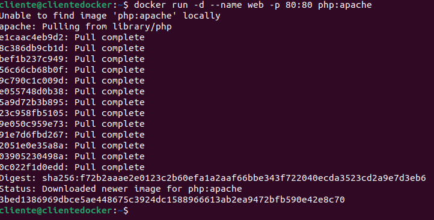

  

  ```bash
  $ docker run -d --name web -p 80:80 php:apache
  ```

- Arrancar un contenedor que se llame `bbdd` y que ejecute una instancia de la imagen **mariadb** para que sea accesible desde el puerto 3306.

- Antes de arrancarlo visitar la página del contenedor en <u>Docker Hub</u> y establecer las variables de entorno necesarias para que:

  - La contraseña de root sea `root` .

  - Crear una base de datos automáticamente al arrancar que se llame `prueba` .

  - Crear el usuario `invitado` con la contraseña `invitado` .

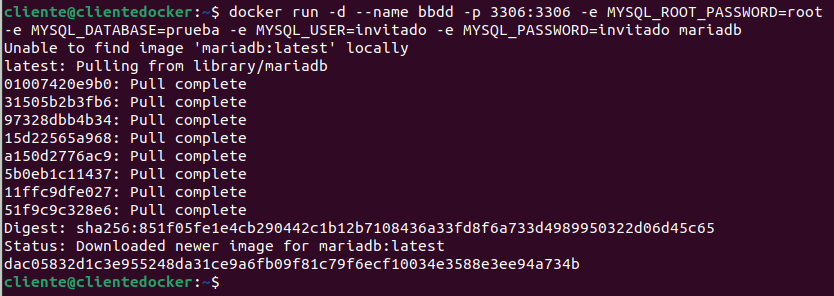

```bash
$ docker run -d --name bbdd -p 3306:3306 -e MYSQL_ROOT_PASSWORD=root -e MYSQL_DATABASE=prueba -e MYSQL_USER=invitado -e MYSQL_PASSWORD=invitado mariadb
```

Entregar un documento con las siguientes capturas de pantalla y los comandos empleados para
resolver cada apartado:

- Captura de pantalla y documento que desde el navegador muestre el fichero `index.html` .

  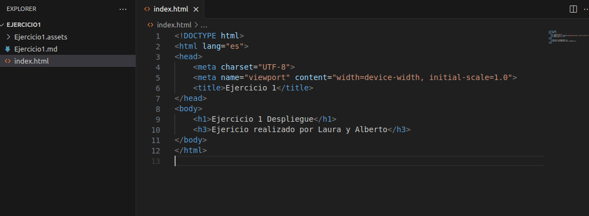 

  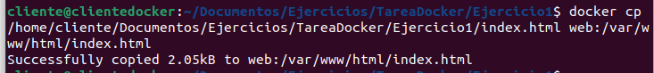

  ```bash 
  $ docker cp /home/cliente/Documentos/Ejercicios/TareaDocker/Ejercicio1/index.html web:/var/www/html/index.html
  ```

  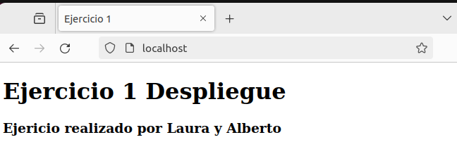

- Captura de pantalla y documento que desde un navegador muestre la salida del script `mes.php .`

  

  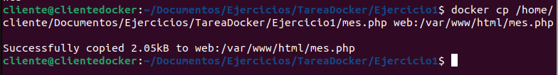

  ```bash
  $ docker cp /home/cliente/Documentos/Ejercicios/TareaDocker/Ejercicio1/mes.php web:/var/www/html/mes.php 
  ```

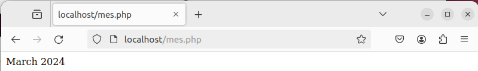

- Captura de pantalla y documento donde se vea el tamaño del contenedor `web` después de crear los dos ficheros.

  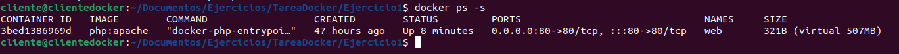

- Captura de pantalla y documento donde desde un cliente de base de datos (instalado en tu ordenador, por ejemplo `dbeaver` ) se pueda observar que hemos podido conectarnos al servidor de base de datos con el usuario creado y que se ha creado la base de datos prueba (`show databases)`. El acceso se debe realizar desde el ordenador que tenéis instalado docker, <u>no</u> hay que acceder desde dentro del contenedor, es decir, no usar `docker exec` .

  ​	Primero instamos el DBeaver desde el Ubuntu Software, una vez instalados abrimos y creamos 	una conexión a la base de datos, abriendo la opción de menú 'Database' y seleccionando la opción 

  ​	'New Database Connection' y seleccionamos la base de datos de 'MySQL'

  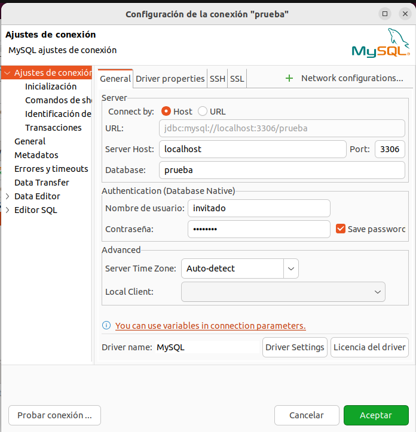

  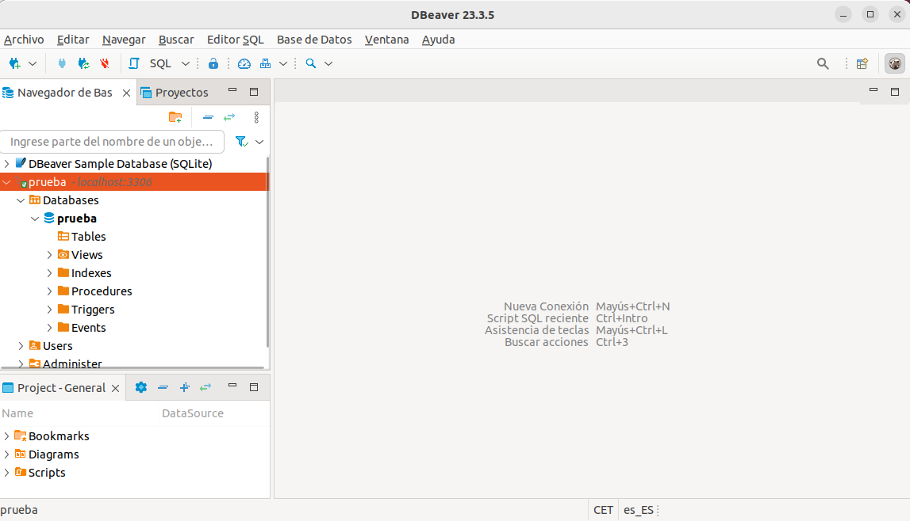

- Captura de pantalla y documento donde se comprueba que no se puede borrar la imagen `mariadb` mientras el contenedor `bbdd` está creado.


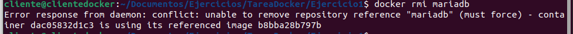
