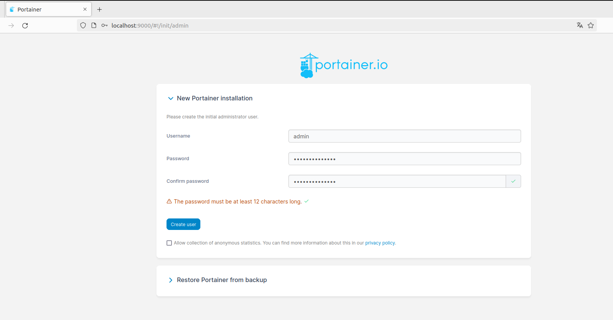

# Ejercicio 2 - Portainer


**Utiliza una imagen de 'Portainer' para gestionar Docker.**

**Documenta la aplicación, su puesta en funcionamiento y realiza capturas de varias operaciones, por ejemplo:**


-Primero, descargamos la imagen de de Portainer Community Edition e iniciamos el contenedor de Portainer, en este caso, en el puerto 9000:

```bash
$ docker run -d -p 9000:9000 --name=portainer --restart=always -v /var/run/docker.sock:/var/run/docker.sock portainer/portainer-ce
```


-Luego, accedemos a `http://localhost:9000` y configuramos la contraseña de administrador:



-Y ya lo tendríamos listo para usar:


**- Capturas de algunas operaciones realizadas en Portainer:**

- **Muestra contenedores activos, para un contenedor, borra un contenedor.**

  -El dashboard:

  

  -Contenedores activos:

  

  -Paramos un contenedor:

  

  -Borramos un contenedor:

  

  

  

- **Muestra alguna operación con redes Docker.**

  -Las redes existentes:

  

  -Eliminamos una red:

  

  

- **Muestra alguna operación con volúmenes Docker.**

  -Los volúmenes actuales:
  
  
  
  -Este es uno de los volúmenes que tengo:
  
  
  
  -Eliminamos un volumen:
  
  


