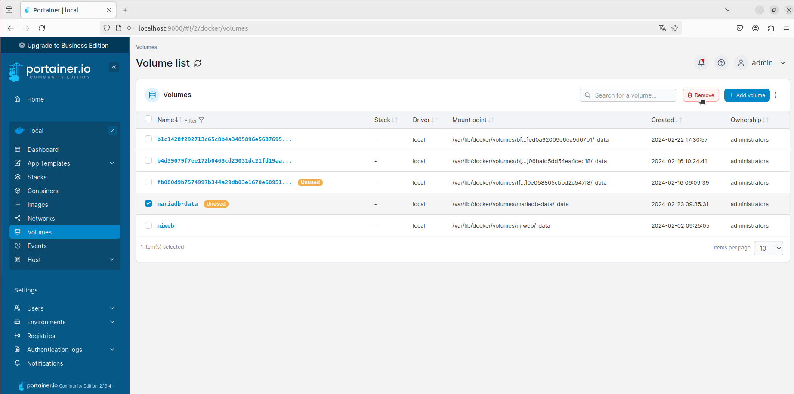

# Ejercicio 3 - contenedores en red: Adminer y MariaDB


> Realizado por: Laura Suárez Suárez


1. **Crea una red bridge redbd**.

     

2. **Crea un contenedor con una imagen de mariaDB que estará en la red redbd . Este contenedor se ejecutará en segundo plano, y será accesible a través del puerto 3306. (Es necesario definir la contraseña del usuario root y un volumen de datos persistente)**.

     ```bash
     $ docker run -d --name mariadb-container -e MYSQL_ROOT_PASSWORD=1234 -p 3306:3306 --network redbd -v mariadb-data:/var/lib/mysql mariadb
     ```

     

3. **Crear un contenedor con Adminer que se pueda conectar al contenedor de la BD**.

     ```bash
     $ docker run -d --name adminer -p 8080:8080 --network redbd adminer
     ```

     

4. **Comprobar que el contenedor Adminer puede conectar con el contenedor mysql abriendo un navegador web y accediendo a la URL: http://localhost:8080. **

     

     

     **Entregar los siguientes Captura de pantalla y documentos y los comandos empleados para resolver cada apartado:**

  **-Captura de pantalla y documento donde se vean los contenedores creados y en ejecución**.


  **-Captura de pantalla y documento donde se vea el acceso a la BD a través de la interfaz web de Adminer.**


  **-Captura de pantalla y documento donde se vea la creación de una BD con la interfaz web Adminer.**


  **-Captura de pantalla y documento donde se entre a la consola del servidor web en modo texto y se compruebe que se ha creado la BD.**


**-Borrar los contenedores, la red y los volúmenes utilizados.**

Borramos los contenedores:


Borramos la red:


Y por último borramos el volumen:




