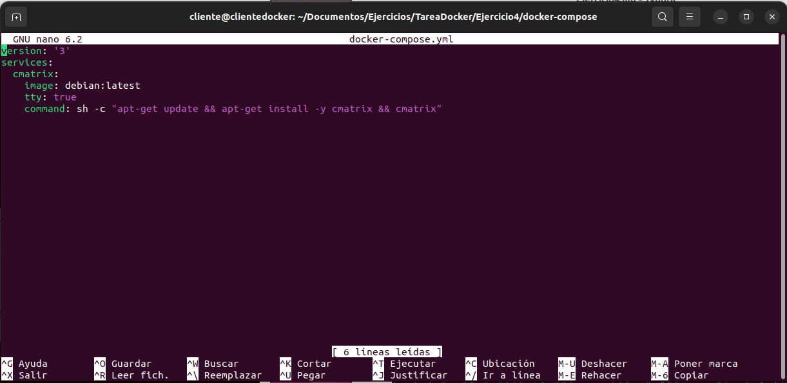
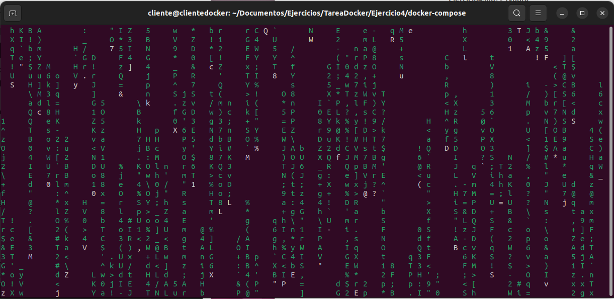

# Ejercicio 4


> Realizado por Alberto Vicente Díaz


Desplegar la aplicación **cmatrix** utilizando docker-compose.

Entregar las siguientes capturas de pantalla y los comando empleados para resolver el ejercicio:

- Captura de pantalla y documento donde ser vea el fichero  `docker-compose.yml`.

  

- Captura de pantalla y documento donde se vea la aplicación funcionando. Se valorará conseguir el efecto **Greenrain**.

  ```bash
  $ docker-compose up -d
  $ docker-compose exec cmatrix bash
  # cmatrix -C green
  ```

  

- Explicar brevemente cómo funciona esta aplicación.

  `cmatrix` es una aplicación que muestra una simulación de la  matriz de código como la que se ve en la película "The Matrix". Funciona mostrando una secuencia de caracteres que caen por la pantalla,  simulando la lluvia de código que se ve en la película.

```
Si esta aplicación no funciona, puyedes usar cualquier otra que NO se haya usado en clase
```

