# Ejercicio 5 - imagen con Dockerfile - Aplicación web


> Realizado por: Laura Suárez Suárez


**Para la realización de este ejercicio es necesario tener una cuenta en Docker Hub.**

- **Arranca un contenedor que ejecute una instancia de la imagen php:7.4-apache , que se llame web y que sea accesible desde un navegador en el puerto 8000.**

  ```bash
  $ docker run -d -p 8000:80 --name web php:7.4-apache
  ```

  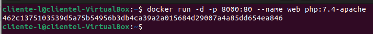

- **Coloca en el directorio raíz del servicio web ( /var/www/html ) un sitio web donde figure el nombre de los componentes del grupo - el sitio deberá tener al menos un archivo index.html y un archivo.css .**

  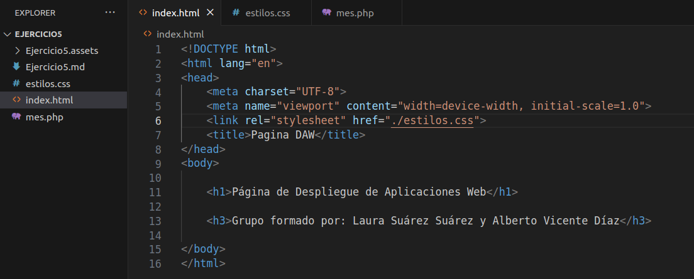

  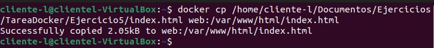

  ```bash
  $ docker cp /home/cliente-l/Documentos/Ejercicios/TareaDocker/Ejercicio5/index.html web:/var/www/html/index.html
  ```

  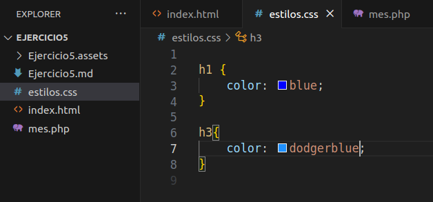

  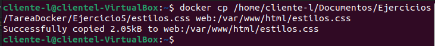

  ```bash
  $ docker cp /home/cliente-l/Documentos/Ejercicios/TareaDocker/Ejercicio5/estilos.css web:/var/www/html/estilos.css
  ```

  -Salida en el navegador:

  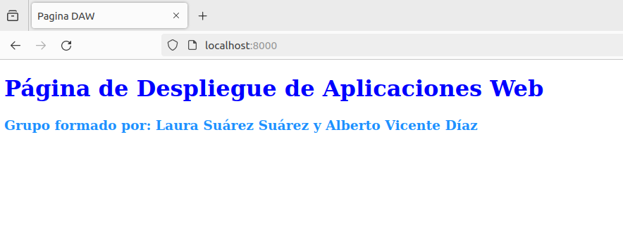

- **Coloca en ese mismo directorio raíz un archivo llamado mes.php que muestre el nombre del mes actual. Ver la salida del script en el navegador.**

  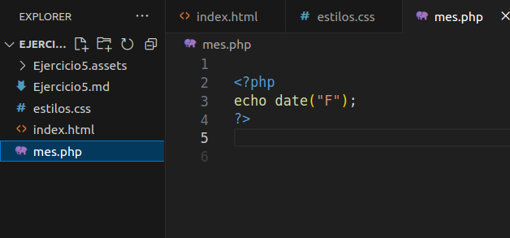

  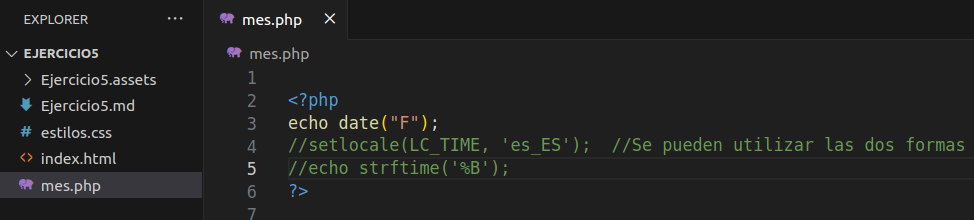

  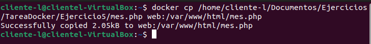

  ```bash
  $ docker cp /home/cliente-l/Documentos/Ejercicios/TareaDocker/Ejercicio5/mes.php web:/var/www/html/mes.php
  ```

  -Salida en el navegador:

  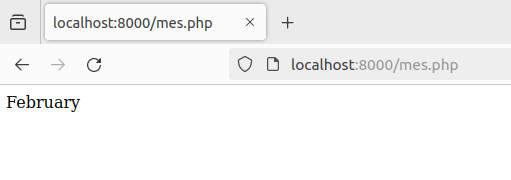

- **Borrar el contenedor.**

  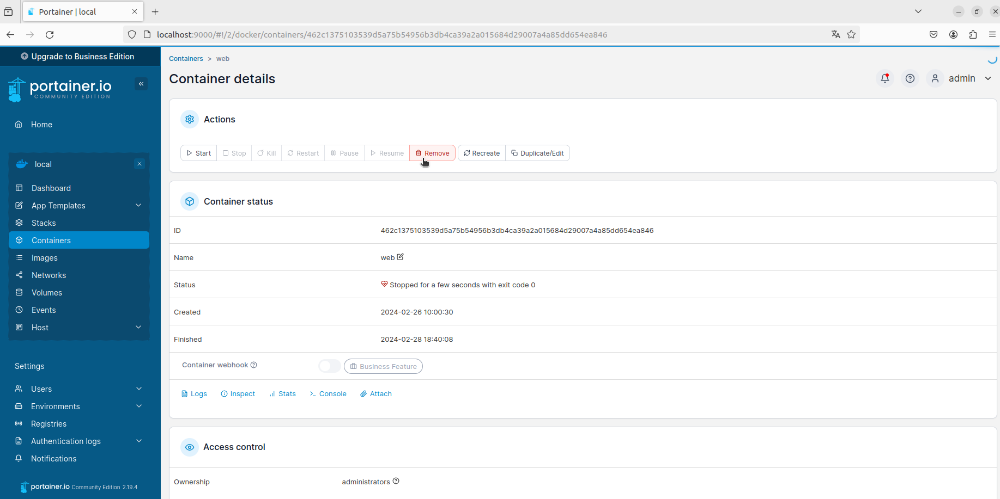

  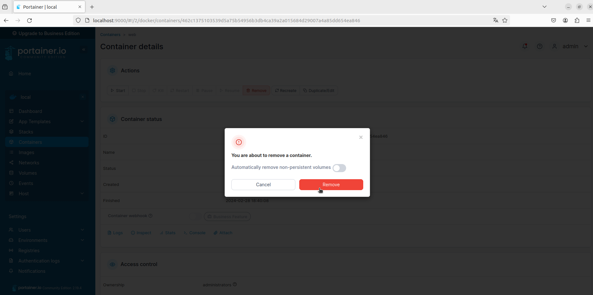

  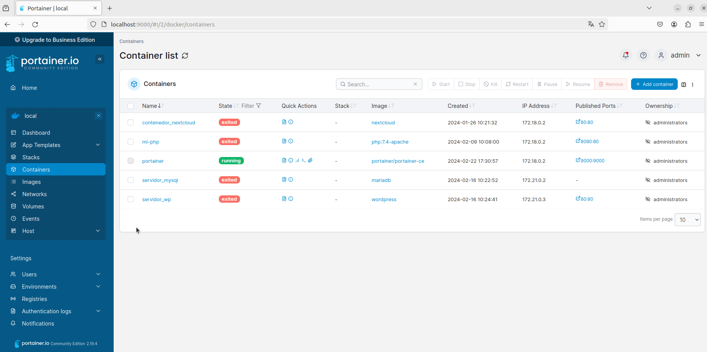

- **Automatizar estas operaciones creando un fichero Dockerfile.**

  -Creamos el fichero y su contenido:

  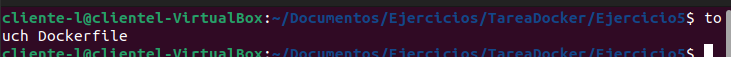

  ```bash
  $ touch Dockerfile
  ```

  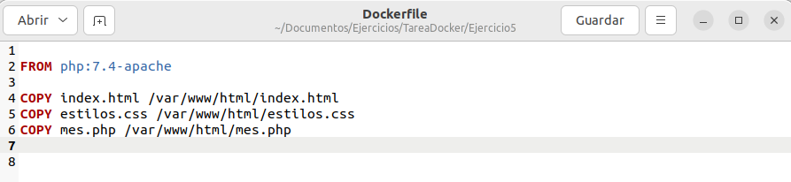

- **Subir la imagen a la cuenta de Docker Hub.**

  -Creamos una cuenta en Docker Hub:

  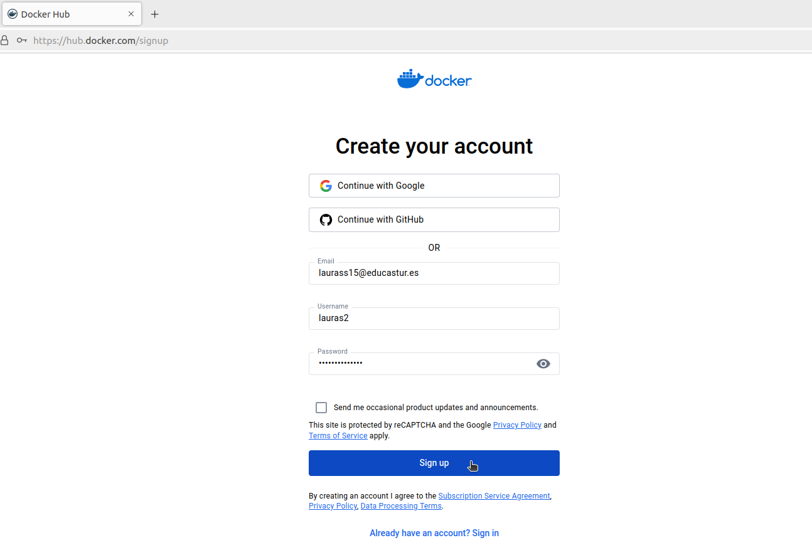

  -Creamos la imagen:

  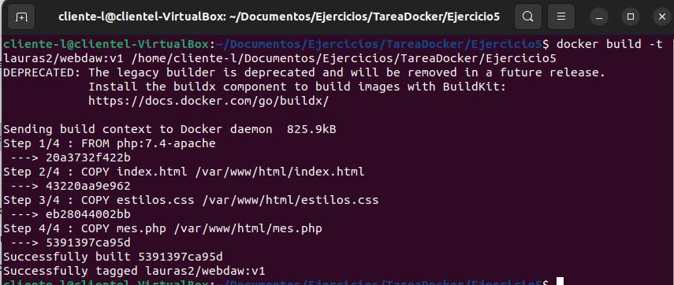

  ```bash
  $ docker build -t lauras2/webdaw:v1 /home/cliente-l/Documentos/Ejercicios/TareaDocker/Ejercicio5
  ```

  -Subimos la imagen a Docker Hub:

  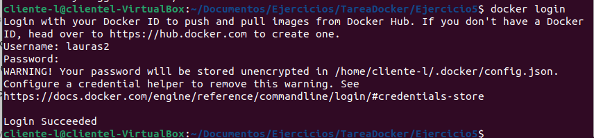

  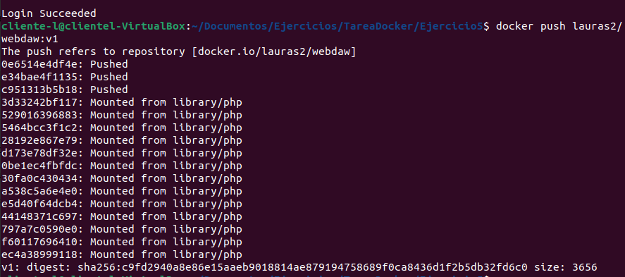

  ```bash
  $ docker login
  $ docker push lauras2/webdaw:v1
  ```

  

**Deberás entregar los siguientes capturas de pantalla y los comandos empleados para resolver cada**
**apartado:**

1. **Creación inicial del contenedor - documenta los pasos hasta el borrado del mismo.**
2. **Bloque de código con el Dockerfile.**
3. **Captura de pantalla y documento donde se vea el comando que crea la nueva imagen.**
4. **Captura de pantalla y documento donde se vea la imagen subida a tu cuenta de Docker Hub.**
5. **Captura de pantalla y documento donde se vea la bajada de la imagen - por parte de otra persona del grupo - y la creación de un contenedor.**
6. **Captura de pantalla y documento donde se ve el acceso al navegador con el sitio servido.**
